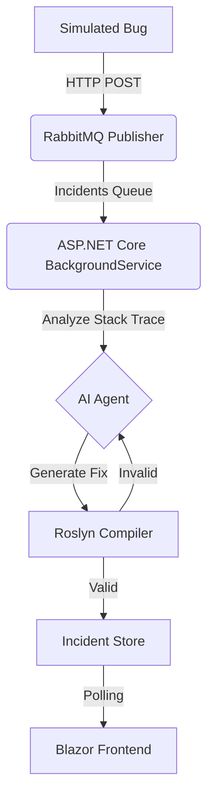
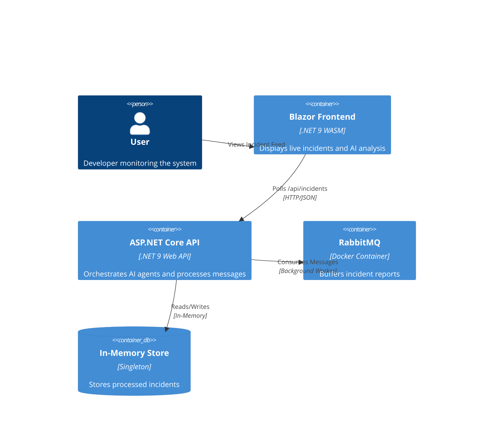

# AutoMender: Self-Healing .NET Core AI Agent 🤖✨


**AutoMender** is an advanced **Autonomous AI Agent** designed to monitor, analyze, and *automatically fix* runtime exceptions in .NET applications. By integrating **RabbitMQ** for asynchronous messaging, **Roslyn** for static analysis, and **Generative AI** (OpenAI/Groq/DeepSeek), it creates a robust self-healing ecosystem.

---

## 🚀 Key Features

*   **Live Incident Monitoring**: Real-time simulation of production bugs via RabbitMQ.
*   **Autonomous Code Fixing**: Uses Semantic Kernel to analyze stack traces and generate safe, compilable fixes.
*   **Validation Gate**: Roslyn-based `CompileCheck` ensures no broken code is ever proposed.
*   **Dynamic AI Configuration**: Switch between **OpenAI**, **Groq**, or **DeepSeek** at runtime without redeploying.
*   **Cloud Agnostic**: Built on **ASP.NET Core 9.0**, running in portable Docker containers. Deploy to AWS, Azure, GCP, or on-prem.
*   **Unified Full-Stack Experience**: Bundled with a bash orchestrator (`start-dev.sh`) to run Backend, Frontend, and Infrastructure in one command.

---

## 🏗️ Architecture

### High-Level Flow
The system follows an event-driven architecture pattern:



### Component Interaction (C4 Level 2)



---

## 🛠️ Getting Started

### Prerequisites
*   .NET 9 SDK
*   Docker (for RabbitMQ)

### Quick Start (One Command)
We've optimized the developer experience to a single script that manages container health, backend, and frontend.

```bash
# Clone the repo
git clone https://github.com/your-username/AutoMender.git
cd AutoMender

# Run the Unified Dev Environment
./start-dev.sh
```
*Access the dashboard at `http://localhost:5110`*

### Simulating a Crash
Once the app is running, open a new terminal and fire this payload to simulate a production crash:

```bash
curl -X POST http://localhost:7071/api/Incidents/simulate \
     -H "Content-Type: application/json" \
     -d '{ "sourceCode": "class P { void M() { string s=null; s.Trim(); } }", 
           "errorLog": "System.NullReferenceException: Object reference not set to an instance of an object." }'
```

---

## 🧠 AI Agent Configuration
AutoMender supports any OpenAI-compatible provider. You can configure this live in the **Admin > Settings** page.

| Provider | Model ID | Base URL |
|----------|----------|----------|
| **Groq** | `llama-3.1-70b-versatile` | `https://api.groq.com/openai/v1` |
| **OpenAI**| `gpt-4o` | *Empty* |
| **DeepSeek**| `deepseek-coder` | `https://api.deepseek.com/v1` |
| **GitHub**| *Check "Integration Settings"* | *Token used for Auto-PRs* |

---

## 🧪 Testing
The solution includes a dedicated xUnit test project covering the Agent logic and Data Store.

```bash
dotnet test AutoMender.Tests
```

---

## 🤝 Contributing
Contributions are welcome! Please read [CONTRIBUTING.md](CONTRIBUTING.md) for details on our code of conduct, and the process for submitting pull requests.

## 📄 License
This project is licensed under the [MIT License](LICENSE).
